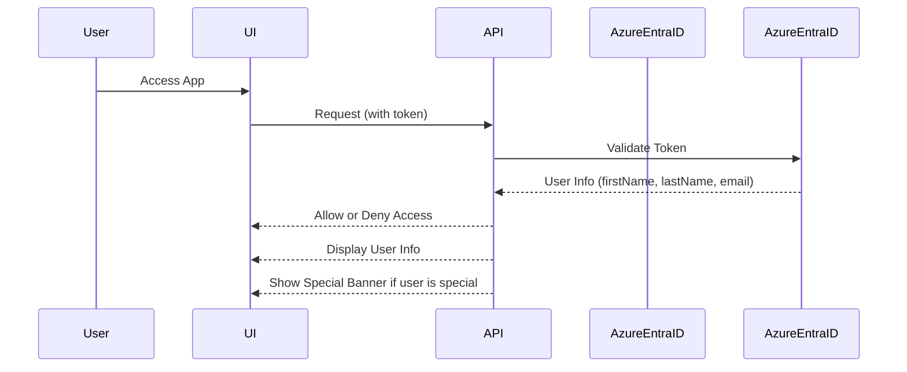

# Azure Entra Authentication & Authorization Flow

## Steps
1. User logs in via Azure Entra (Microsoft Identity platform).
2. The UI sends the access token with each API request.
3. The API validates the token and extracts user info.
4. Only authenticated users can access the app.
5. The UI displays the user's first and last name.
6. If the user's name starts with 'V', a special banner is shown and $100 is credited at the start of each month.
