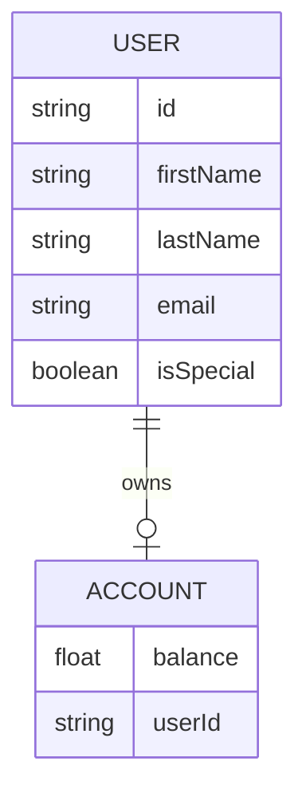

# Entity-Relationship Diagram

## Explanation
- Each user has an account (1:1 relationship).
- The `isSpecial` flag is set for users whose first or last name starts with 'V'.
- The account stores the balance for each user.
