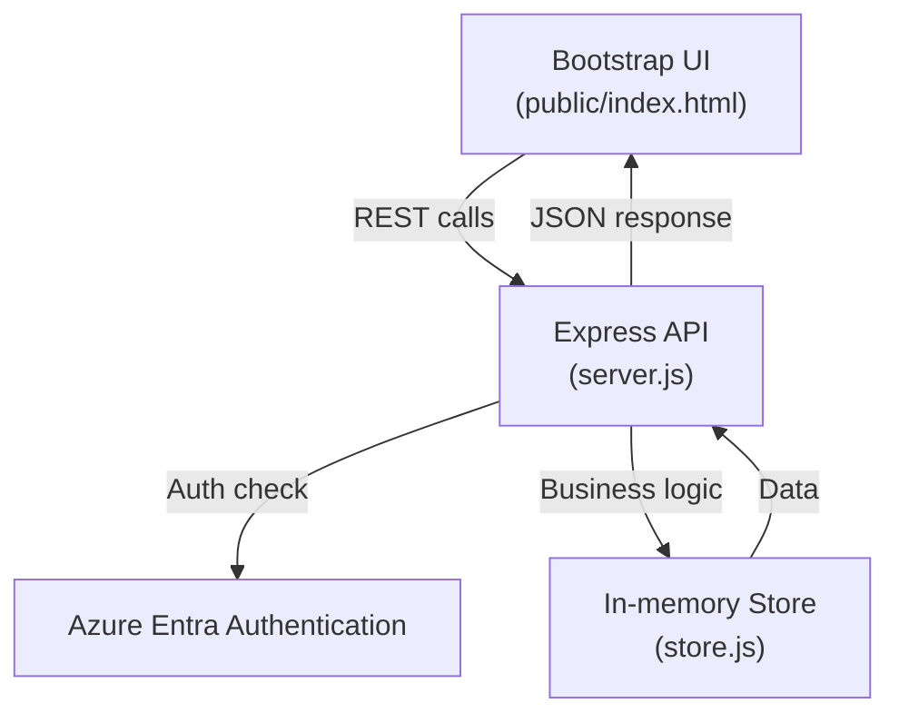

# Module Flow Diagram

## Explanation
- The UI interacts with the API via REST endpoints.
- All API requests are authenticated using Azure Entra.
- The API delegates business logic to the in-memory store.
- Data flows back to the UI as JSON responses.
